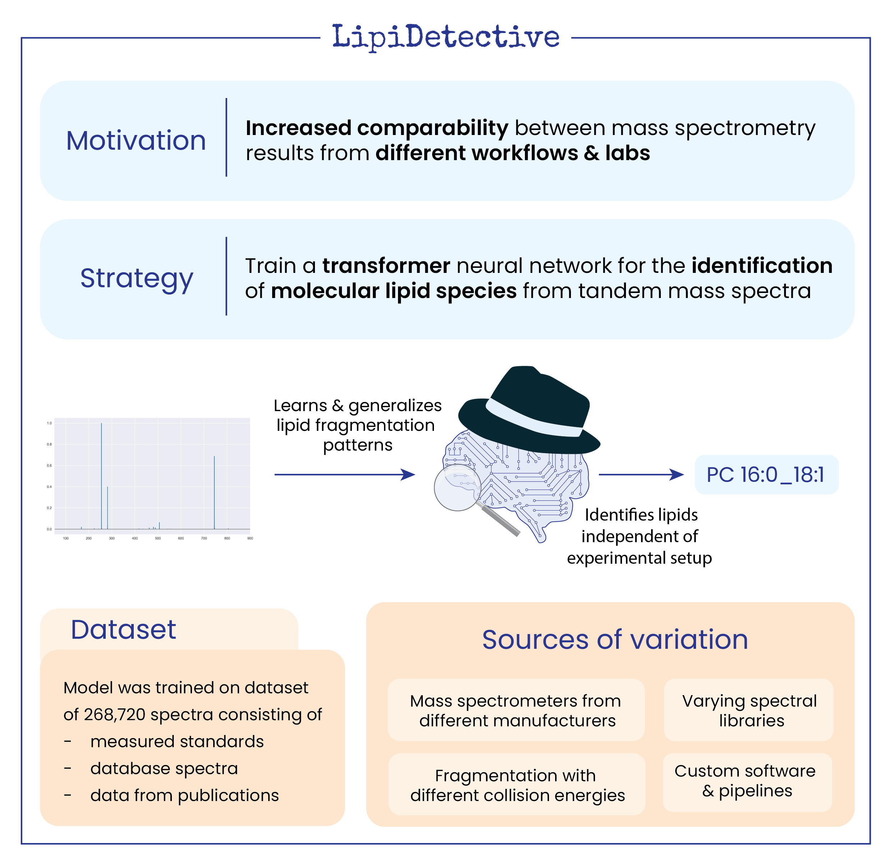

# LipiDetective

**LipiDetective** is a deep learning framework designed for the identification of molecular lipid species from tandem 
mass spectra.

## Features

- **Deep Learning Framework:** Utilizes the transformer architecture to identify lipid species in shorthand nomenclature format.
- **Configurable Input:** Accepts YAML configuration file for streamlined and reproducible setup.
- **Data Handling:** Supports training with HDF5 files and prediction using mzML files.



## Installation

The easiest way to get started with LipiDetective is using [Poetry](https://python-poetry.org) and the provided pyproject.toml file. 
Make sure you have at least python version 3.11 installed. Follow these steps to set up the project:

1. Clone the repository:
   ```bash
   git clone https://github.com/LipiTUM/lipidetective.git
   cd lipidetective

2. Install the dependencies:
   ```bash
   poetry install

3. If necessary activate the virtual environment:
   ```bash
   poetry shell

## Usage

LipiDetective can be executed by running the following command:

   ```bash
   poetry run lipidetective --config path/to/config.yaml
   ```

Ensure that the YAML configuration file is correctly set up with the necessary parameters for the desired workflow.

## Configuration
The configuration file should be in YAML format and contain paths to your HDF5 training files or mzML prediction files,
along with any additional parameters required for the model. A template is provided in the folder `config/config_templates`. 

## License
This project is licensed under the BSD 3-Clause License - see the `LICENSE` file for details.