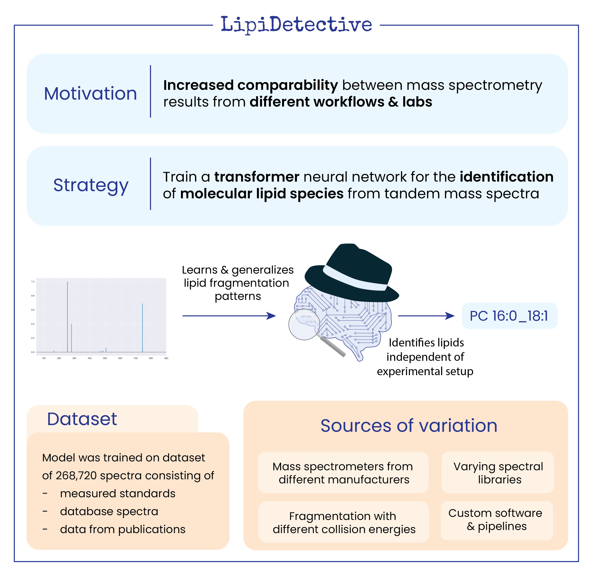

LipiDetective
=============

**Deep learning for lipid identification from tandem mass spectra.**

LipiDetective is a transformer-based framework that identifies molecular lipid
species from MS/MS spectra. Given a tandem mass spectrum, it predicts the molecular 
lipid species name in shorthand notation — including headgroup and fatty acid composition.

.. note::

   This project is under active development.

Getting Started
---------------

1. :doc:`Install <installation>` LipiDetective
2. Follow the :doc:`quickstart` to run your first prediction
3. See the :doc:`configuration` guide for all available options

.. toctree::
   :maxdepth: 2
   :caption: User Guide

   installation
   quickstart
   configuration
   data
   workflows

.. toctree::
   :maxdepth: 2
   :caption: Reference

   models
   output
   api

Indices and Tables
------------------

* :ref:`genindex`
* :ref:`modindex`
